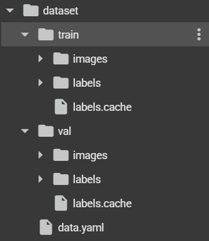
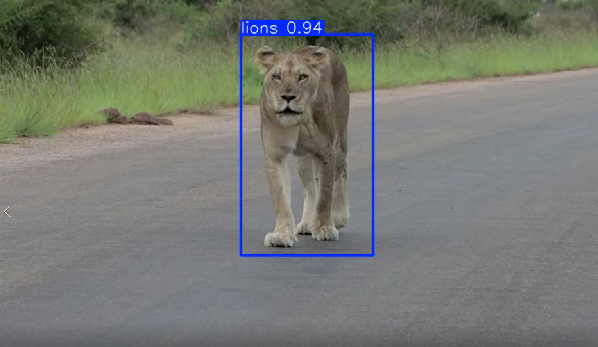
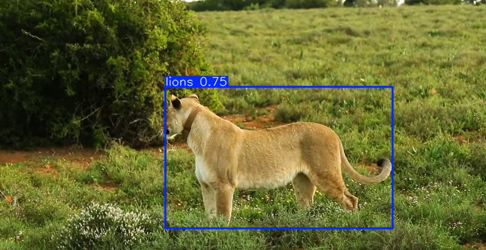

YOLO Custom Dataset Object Detection
This project demonstrates how to train and use YOLO (You Only Look Once) for object detection on a custom dataset.

Prepare Dataset:
Organize dataset into folders: /images/train, /images/val, and corresponding /labels/train, /labels/val.

Configure YOLO:
Create a custom .yaml file describing your dataset (classes, train/val paths).
Modify the YOLO model configuration file if needed.

Train the Model:
Run the training command, specifying the dataset config, model architecture, and hyperparameters.

Example: python train.py --img 320 --batch 10 --epochs 50 --data data.yaml --weights yolov11n.pt

YOLO format: <class> <x_center> <y_center> <width> <height> normalized between 0 and 1.

------------------------

------------------------

